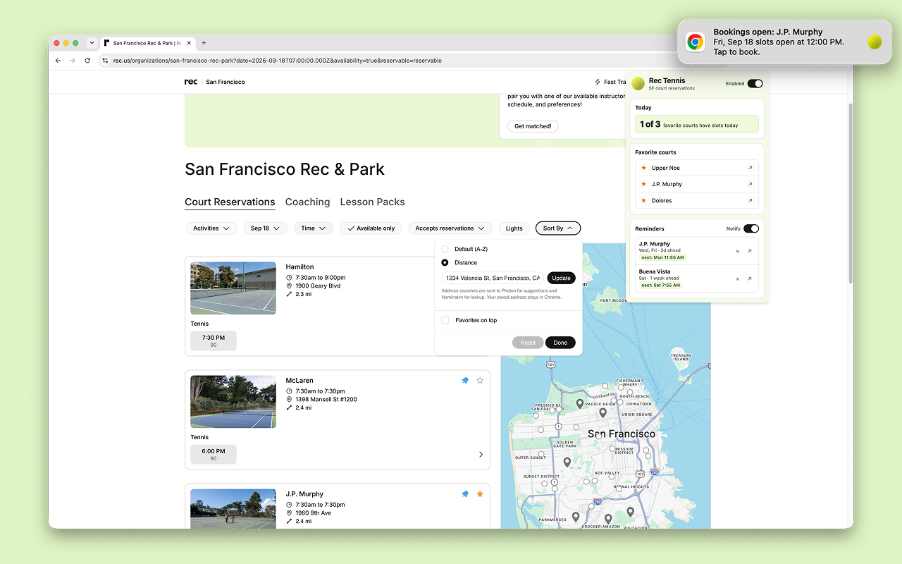
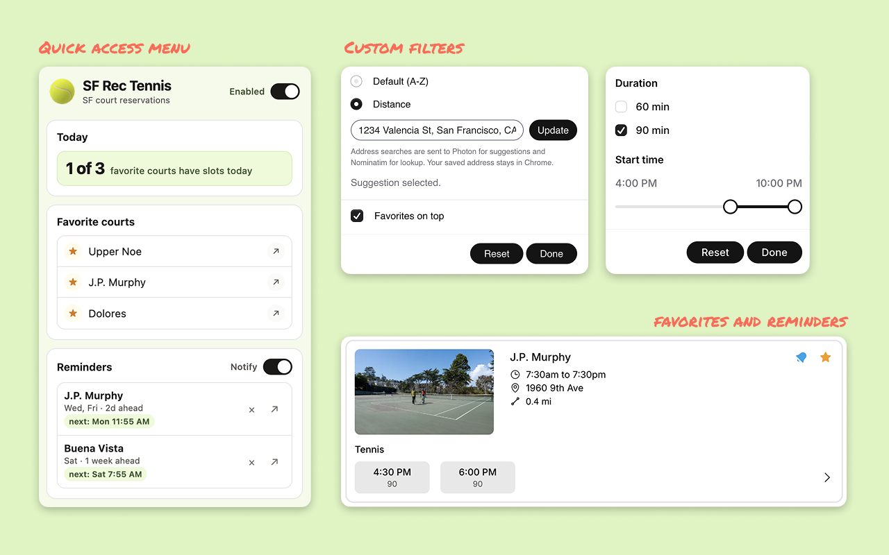

# SF Rec Tennis

SF Rec Tennis is an unofficial Chrome extension that makes it easier to find and reserve tennis courts on [rec.us](https://www.rec.us/), starting with San Francisco Rec & Park.

It adds precise time and duration filters, favorites, distance sorting, court-light filters, and reminders for reservation windows. It does not make reservations automatically.

## Install

The Chrome Web Store listing is coming soon. Until then, packaged builds may be downloaded from [Releases](https://github.com/araid/sf-rec-tennis/releases) and loaded manually:

1. Download the ZIP attached to the latest release and extract it into a new folder.
2. Open `chrome://extensions` in Chrome.
3. Enable **Developer mode**.
4. Select **Load unpacked**, then choose the extracted folder that contains `manifest.json`.

Only install builds you trust. Chrome may restrict developer-mode extensions on managed devices.

## Support and feedback

- [Report a bug](https://github.com/araid/sf-rec-tennis/issues/new?template=bug_report.yml)
- [Request a feature](https://github.com/araid/sf-rec-tennis/issues/new?template=feature_request.yml)
- [View known issues](https://github.com/araid/sf-rec-tennis/issues)
- [Read the privacy policy](https://araid.github.io/sf-rec-tennis/privacy.html)

Please do not put addresses, account details, reservation information, or other sensitive data in a public issue.

## About this repository

This is the public home for SF Rec Tennis documentation, support, privacy information, and packaged releases. The extension's source code and development history are maintained separately and are not published here.

SF Rec Tennis is an independent project and is not affiliated with or endorsed by rec.us or San Francisco Recreation and Parks.
